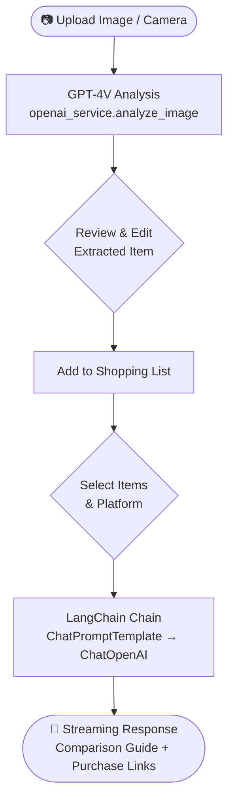
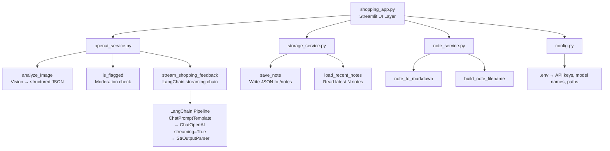

# AI Shopping Assistant

<div align="center">


Upload a product photo → AI identifies the item → instantly find where to buy it.

</div>

---

## 📌 Overview

AI Shopping Assistant is a Streamlit web application that lets users photograph any product or receipt. OpenAI's GPT-4V (Vision) model analyzes the image, extracts product details, and LangChain streams a real-time comparison guide with direct purchase links for platforms such as Coupang, Naver Shopping, and Google.

---

## ✨ Features

| # | Feature | Description |
|---|---------|-------------|
| 1 | **Image-Based Item Extraction** | Camera input or file upload; GPT-4V parses product name and price from any photo or receipt |
| 2 | **Editable Results** | Review and edit extracted name, price, and quantity before adding to the list |
| 3 | **Shopping List Management** | Checkbox-driven todo-style list with per-item and total price calculation plus selective delete |
| 4 | **Online Price Comparison** | Select items and a platform; LangChain streams a personalized comparison guide with direct search links |
| 5 | **Content Moderation** | User-edited text is screened with OpenAI Moderation before being added to the list |
| 6 | **STT / TTS Support** | Speech-to-text via `gpt-4o-mini-transcribe`; text-to-speech via `gpt-4o-mini-tts` |
| 7 | **Note Service** | Study notes are structured, saved as JSON, and loaded in recency order |

---

## 🛠 Tech Stack

| Category | Technology | Purpose |
|----------|-----------|---------|
| UI | Streamlit | Web interface and real-time streaming display |
| Image Analysis | OpenAI Vision (GPT-4V / `gpt-4.1-mini`) | Multimodal product and receipt recognition |
| LLM Orchestration | LangChain (`ChatOpenAI`) | Prompt chaining and streaming response pipeline |
| Content Safety | OpenAI Moderation (`omni-moderation-latest`) | Input safety screening |
| Speech Input | `gpt-4o-mini-transcribe` | Speech-to-text |
| Speech Output | `gpt-4o-mini-tts` | Text-to-speech |
| Storage | Local JSON files | Note and audio output persistence |
| Config | python-dotenv | Environment variable management |

---

## 📁 Project Structure

```
Shopping_app/
├── shopping_app.py       # Main Streamlit UI
├── openai_service.py     # OpenAI & LangChain API calls
├── storage_service.py    # JSON-based note persistence
├── note_service.py       # Note formatting helpers
├── config.py             # Env vars & directory setup
├── requirements.txt      # Python dependencies
├── notes/                # Auto-created; stores note JSON files
└── audio_outputs/        # Auto-created; stores TTS audio files
```

---

## 🚀 Getting Started

### Prerequisites

- Python 3.10+
- An [OpenAI API key](https://platform.openai.com/api-keys) with access to GPT-4V

### Installation

```bash
# 1. Clone the repository
git clone https://github.com/vosnuev/Shopping_app.git
cd Shopping_app

# 2. Install dependencies
pip install -r requirements.txt

# 3. Configure environment variables
cp .env.example .env   # then fill in OPENAI_API_KEY

# 4. Run the app
streamlit run shopping_app.py
```

The app opens at `http://localhost:8501` by default. The `notes/` and `audio_outputs/` directories are created automatically on first run.

### Environment Variables

Create a `.env` file in the project root:

```env
# Required
OPENAI_API_KEY=sk-...

# Optional — defaults shown
DEFAULT_MODEL=gpt-4.1-mini
STT_MODEL=gpt-4o-mini-transcribe
TTS_MODEL=gpt-4o-mini-tts
TTS_VOICE=alloy
MODERATION_MODEL=omni-moderation-latest
```

| Variable | Default | Description |
|----------|---------|-------------|
| `OPENAI_API_KEY` | — | OpenAI API key **(required)** |
| `DEFAULT_MODEL` | `gpt-4.1-mini` | Vision + chat model |
| `STT_MODEL` | `gpt-4o-mini-transcribe` | Speech-to-text model |
| `TTS_MODEL` | `gpt-4o-mini-tts` | Text-to-speech model |
| `TTS_VOICE` | `alloy` | TTS voice preset |
| `MODERATION_MODEL` | `omni-moderation-latest` | Content moderation model |

---

## 🔄 Usage Flow



**Step-by-step:**

1. Take a photo or upload a product image.
2. Click **Analyze** — GPT-4V extracts item name and price.
3. Review and edit the result, then add it to your shopping list.
4. Check the items you want to compare and select a platform (Coupang / Naver Shopping / Google).
5. Click **Start Comparison** — a streaming AI response with direct purchase links appears in real time.

---

## 🏗 Architecture



---

## 🎯 Skills Demonstrated

| Skill Area | Implementation | Detail |
|-----------|---------------|--------|
| **Multimodal AI** | OpenAI GPT-4V (Vision) | Extracts structured product data from arbitrary photos and receipts |
| **Real-Time Streaming** | LangChain + Streamlit `st.write_stream` | Streams LLM tokens to the UI as they are generated |
| **LangChain Orchestration** | `ChatPromptTemplate → ChatOpenAI → StrOutputParser` | Declarative prompt pipeline with streaming output |
| **Content Safety** | OpenAI Moderation API | Screens user input before processing |
| **Voice I/O** | GPT-4o-mini Transcribe + TTS | Full speech-to-text and text-to-speech loop |
| **State Management** | Streamlit `session_state` | Persistent shopping list and UI state across interactions |
| **Modular Architecture** | Service-layer separation | UI, AI calls, storage, and config are fully decoupled |

---

## 📄 License

This project is open source. See [LICENSE](LICENSE) for details.

**References:**
- [OpenAI API Documentation](https://platform.openai.com/docs)
- [LangChain Documentation](https://python.langchain.com/docs/)
- [Streamlit Documentation](https://docs.streamlit.io/)
