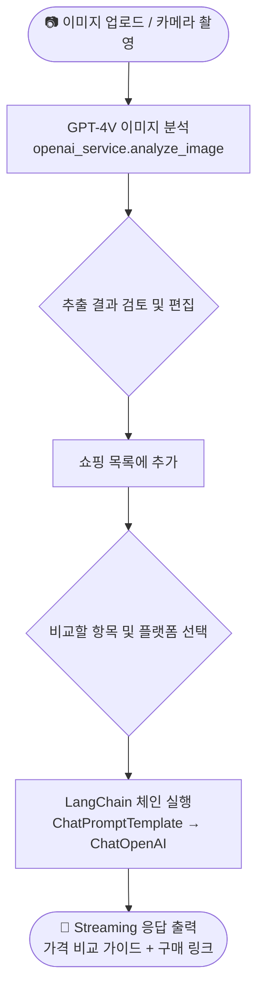
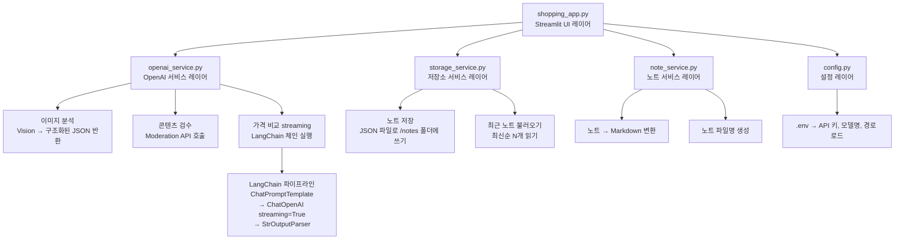

# AI Shopping Assistant

<div align="center">


**이미지 인식 AI로 상품을 분석하고 구매 링크를 추천하는 쇼핑 어시스턴트**

</div>

---

## 📌 개요

AI Shopping Assistant는 Streamlit 기반 웹 애플리케이션으로, 사용자가 상품 사진이나 영수증을 촬영·업로드하면 OpenAI의 GPT-4V (Vision) 모델이 이미지를 분석해 상품 정보를 추출하고, LangChain이 쿠팡·네이버 쇼핑·Google 등 플랫폼별 구매 링크를 포함한 가격 비교 가이드를 실시간 streaming으로 제공합니다.

---

## ✨ 주요 기능

| # | 기능명 | 설명 |
|---|--------|------|
| 1 | **이미지 기반 상품 추출** | 카메라 촬영 또는 파일 업로드 후 GPT-4V가 상품명과 가격을 자동 파싱 |
| 2 | **추출 결과 편집** | 인식된 상품명·가격·수량을 검토하고 수정한 뒤 목록에 추가 |
| 3 | **쇼핑 목록 관리** | 체크박스 방식의 할 일 목록으로 항목별·합계 금액 계산 및 선택 삭제 지원 |
| 4 | **온라인 가격 비교** | 원하는 항목과 플랫폼을 선택하면 LangChain이 구매 링크 포함 비교 가이드를 streaming으로 출력 |
| 5 | **콘텐츠 모더레이션** | 사용자 입력 텍스트를 OpenAI Moderation으로 검수 후 목록에 반영 |
| 6 | **STT / TTS 지원** | `gpt-4o-mini-transcribe`로 음성 인식(STT), `gpt-4o-mini-tts`로 음성 합성(TTS) |
| 7 | **노트 서비스** | 학습 노트를 구조화하여 JSON으로 저장하고 최신순으로 불러오기 |

---

## 🛠 기술 스택

| 분류 | 기술 | 설명 |
|------|------|------|
| UI | Streamlit | 웹 인터페이스 및 실시간 streaming 표시 |
| 이미지 분석 | OpenAI Vision (GPT-4V / `gpt-4.1-mini`) | 상품·영수증 multimodal 인식 |
| LLM 오케스트레이션 | LangChain (`ChatOpenAI`) | 프롬프트 체이닝 및 streaming 응답 파이프라인 |
| 콘텐츠 안전 | OpenAI Moderation (`omni-moderation-latest`) | 입력 안전성 검수 |
| 음성 입력 | `gpt-4o-mini-transcribe` | 음성 → 텍스트 변환 (STT) |
| 음성 출력 | `gpt-4o-mini-tts` | 텍스트 → 음성 변환 (TTS) |
| 저장소 | 로컬 JSON 파일 | 노트 및 오디오 출력 영속성 관리 |
| 설정 | python-dotenv | 환경 변수 관리 |

---

## 📁 프로젝트 구조

```
Shopping_app/
├── shopping_app.py       # Streamlit 메인 UI 진입점
├── openai_service.py     # OpenAI 및 LangChain API 호출 모듈
├── storage_service.py    # JSON 기반 노트 영속성 처리
├── note_service.py       # 노트 포맷 변환 헬퍼
├── config.py             # 환경 변수 로드 및 디렉토리 초기화
├── requirements.txt      # Python 의존성 목록
├── notes/                # 자동 생성 - 노트 JSON 파일 저장 폴더
└── audio_outputs/        # 자동 생성 - TTS 오디오 파일 저장 폴더
```

---

## 🚀 시작하기

### 필수 조건

- Python 3.10 이상
- GPT-4V 접근 권한이 있는 [OpenAI API 키](https://platform.openai.com/api-keys)

### 설치 및 실행

```bash
# 1. 레포지토리 클론
git clone https://github.com/vosnuev/Shopping_app.git
cd Shopping_app

# 2. 의존성 설치
pip install -r requirements.txt

# 3. 환경 변수 설정
cp .env.example .env   # 이후 OPENAI_API_KEY 입력

# 4. 앱 실행
streamlit run shopping_app.py
```

기본적으로 `http://localhost:8501`에서 앱이 열립니다. `notes/`와 `audio_outputs/` 디렉토리는 첫 실행 시 자동으로 생성됩니다.

### 환경 변수 설정

프로젝트 루트에 `.env` 파일을 생성하고 아래 변수를 입력하세요.

```env
# 필수
OPENAI_API_KEY=sk-...

# 선택 (기본값 표시)
DEFAULT_MODEL=gpt-4.1-mini
STT_MODEL=gpt-4o-mini-transcribe
TTS_MODEL=gpt-4o-mini-tts
TTS_VOICE=alloy
MODERATION_MODEL=omni-moderation-latest
```

| 변수명 | 기본값 | 설명 |
|--------|--------|------|
| `OPENAI_API_KEY` | - | OpenAI API 키 **(필수)** |
| `DEFAULT_MODEL` | `gpt-4.1-mini` | Vision + 채팅 모델 |
| `STT_MODEL` | `gpt-4o-mini-transcribe` | 음성 인식(STT) 모델 |
| `TTS_MODEL` | `gpt-4o-mini-tts` | 음성 합성(TTS) 모델 |
| `TTS_VOICE` | `alloy` | TTS 음성 프리셋 |
| `MODERATION_MODEL` | `omni-moderation-latest` | 콘텐츠 모더레이션 모델 |

---

## 🔄 사용 흐름



**단계별 사용 방법:**

1. 상품 사진을 촬영하거나 이미지 파일을 업로드합니다.
2. **분석** 버튼을 클릭하면 GPT-4V가 상품명과 가격을 추출합니다.
3. 추출된 결과를 확인·수정한 뒤 쇼핑 목록에 추가합니다.
4. 비교할 항목을 체크하고 플랫폼(쿠팡 / 네이버 쇼핑 / Google)을 선택합니다.
5. **비교 시작** 버튼을 클릭하면 구매 링크 포함 AI 응답이 실시간 streaming으로 표시됩니다.

---

## 🏗 아키텍처



---

## 🎯 습득 기술 및 역량

| 역량 분야 | 구현 방식 | 상세 설명 |
|-----------|-----------|-----------|
| **Multimodal AI** | OpenAI GPT-4V (Vision) | 임의의 상품 사진·영수증에서 구조화된 상품 데이터 추출 |
| **실시간 Streaming** | LangChain + Streamlit `st.write_stream` | LLM 토큰을 생성과 동시에 UI에 실시간 출력 |
| **LangChain 오케스트레이션** | `ChatPromptTemplate → ChatOpenAI → StrOutputParser` | Streaming 출력을 지원하는 선언형 프롬프트 파이프라인 구성 |
| **콘텐츠 안전 처리** | OpenAI Moderation API | 처리 전 사용자 입력 안전성 검수 |
| **음성 입출력 (Voice I/O)** | GPT-4o-mini Transcribe + TTS | STT·TTS 통합 음성 처리 루프 구현 |
| **상태 관리** | Streamlit `session_state` | 인터랙션 간 쇼핑 목록 및 UI 상태 영속적 유지 |
| **모듈형 아키텍처** | 서비스 레이어 분리 설계 | UI, AI 호출, 저장소, 설정을 완전히 분리한 구조 |

---

## 📄 라이선스

이 프로젝트는 오픈 소스입니다. 자세한 내용은 [LICENSE](LICENSE) 파일을 참조하세요.

**참고 문서:**
- [OpenAI API 공식 문서](https://platform.openai.com/docs)
- [LangChain 공식 문서](https://python.langchain.com/docs/)
- [Streamlit 공식 문서](https://docs.streamlit.io/)
